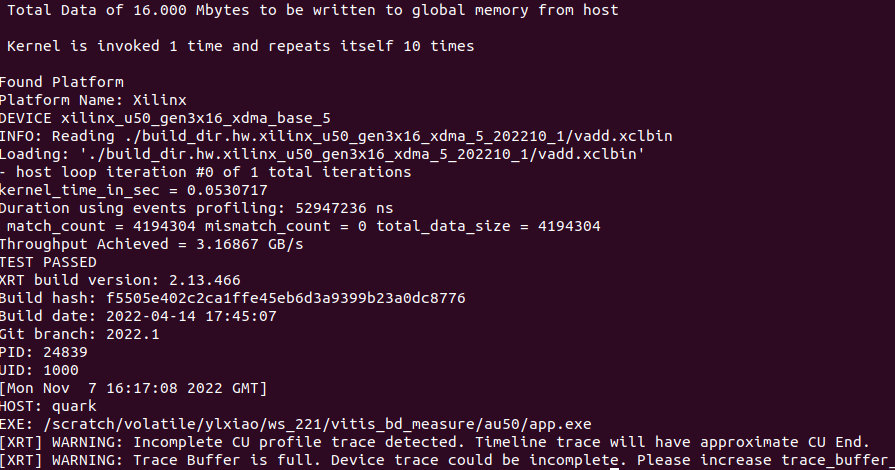

# 1. vitis_bd_measure

## REPO TARGET
This repo is a part from [Xilinx Vitis Tutorial](https://github.com/Xilinx/Vitis-Tutorials/blob/2022.1/Hardware_Acceleration/Feature_Tutorials/07-using-hbm/3_BW_Explorations.md). The goal of this repo is to show the bandwidth we can get with different transaction size.

## Compile Step
Go to <ROOT>/au50 and execute build.sh. You can get results as below.

Open '''makefile_us_alveo.mk''', you can change the txSize and dsize. '''dsize''' represents the size of the data we will transmit between host and fabric.

  
Table 1: Throughput Measurement for vadd
|  **krnl_loop** |**txSize**|**dsize (MB)**|**Throughput (GB/s)**|
|:--------------:|:--------:|:------------:|:-------------------:|
|  1             |64        | 16           |1.24201              |
|  1             |64        | 64           |2.27867              |
|  1             |64        | 256          |7.7591               |
|  1             |64        | 1024         |11.2187              |
|  10            |64        | 16           |3.166                |
|  10            |64        | 64           |3.934                |
|  10            |64        | 256          |12.3211              |
|  10            |64        | 1024         |12.9559              |

# 2. ydma_bd_measure

The throughput for ydma kernel
 
Table 2: Throughput Measurement for ydma
|**SIZE_MB (MB)**|**Throughput (GB/s)**|
|:--------------:|:-------------------:|
|  1             |2.661                |
|  10            |5.574                |
|  20            |6.000                |
|  30            |6.142                |
|  40            |6.203                |
|  50            |6.245                |
|  60            |6.280                |
|  70            |6.281                |
|  80            |6.367                |
|  90            |6.380                |
|  100           |6.375                |
