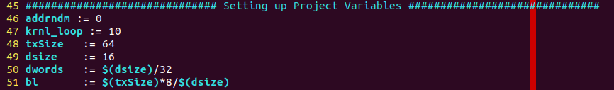

# 1. vitis_bd_measure

## 1.1 REPO TARGET
This repo is a part from [Xilinx Vitis Tutorial](https://github.com/Xilinx/Vitis-Tutorials/blob/2022.1/Hardware_Acceleration/Feature_Tutorials/07-using-hbm/3_BW_Explorations.md). The goal of this repo is to show the bandwidth we can get with different transaction size.

## 1.2 Compile Step
Go to [\<ROOT\>/vitis_bd_measure/au50](vitis_bd_measure/au50) and execute build.sh. You can get results as below.

Open '''makefile_us_alveo.mk''', you can change the txSize and dsize. '''dsize''' represents the size of the data we will transmit between host and fabric.

  
Table 1: Throughput Measurement for vadd
|  **krnl_loop** |**txSize**|**dsize (MB)**|**Throughput (GB/s)**|
|:--------------:|:--------:|:------------:|:-------------------:|
|  1             |64        | 16           |1.24201              |
|  1             |64        | 64           |2.27867              |
|  1             |64        | 256          |7.7591               |
|  1             |64        | 1024         |11.2187              |
|  10            |64        | 16           |3.166                |
|  10            |64        | 64           |3.934                |
|  10            |64        | 256          |12.3211              |
|  10            |64        | 1024         |12.9559              |

# 2. ydma_bd_measure

## 2.1 Compile Step

Go to [\<ROOT\>/ydma_bd_measure/au50](ydma_bd_measure/au50/) and execute build.sh.

## 2.2 Bandwidth Measurement
The throughput for ydma kernel. You can change the '''SIZE_MB''' macro to in [host.cpp](ydma_bd_measure/src/host.cpp) for different transmission size.
 
Table 2: Throughput Measurement for ydma
|**SIZE_MB (MB)**|**Throughput (GB/s)**|
|:--------------:|:-------------------:|
|  1             |3.350                |
|  10            |5.708                |
|  16            |5.915                |
|  64            |6.303                |
|  256           |10.093               |
|  512           |10.173               |
|  1024          |10.204               |

## 2.3 HiPR Bandwidth Measurement
The throughput for ydma kernel. You can change the '''SIZE_MB''' macro to in [host.cpp](ydma_bd_measure/src/host.cpp) for different transmission size.
 
Table 2: Throughput Measurement for ydma
|**SIZE_MB (MB)**|**Throughput (GB/s)**|
|:--------------:|:-------------------:|
|  1             | 0.438               |
|  10            | 0.491               |
|  16            | 0.494               |
|  64            | 0.504               |
|  256           | 0.523               |
|  512           | 0.525               |
|  1024          | 0.523               |
|  2048          | 0.523               |

# 3. increment_bd_measure

## 3.1 Compile Step

Go to [\<ROOT\>/increment_bd_measure/au50](increment_bd_measure/au50/) and execute build.sh.

## 3.2 Raw Bandwidth Measurement
The throughput for ydma kernel. You can change the '''SIZE_MB''' macro to in [typedefs.h](increment_bd_measure/src/typedefs.h) for different transmission size.
 
Table 2: Throughput Measurement for ydma
|**SIZE_MB (MB)**|**Throughput (GB/s)**|
|:--------------:|:-------------------:|
|  1             |0.913                |
|  10            |                     |
|  16            |                     |
|  64            |                     |
|  256           |                     |
|  512           |1.417                |
|  1024          |                     |

## 3.3 HiPR Bandwidth Measurement
The throughput for ydma kernel. You can change the '''SIZE_MB''' macro to in [host.cpp](ydma_bd_measure/src/host.cpp) for different transmission size.
 
Table 2: Throughput Measurement for ydma
|**SIZE_MB (MB)**|**Throughput (GB/s)**|
|:--------------:|:-------------------:|
|  1             |0.919                |
|  10            |1.199                |
|  16            |1.241                |
|  64            |1.278                |
|  256           |1.396                |
|  512           |1.409                |
|  1024          |1.412                |
|  2048          |1.401                |

